# 📘 User Manual

## CSV → Google Form Uploader (Spring Boot + Swing)

---

# 1. Introduction

This user manual explains how to operate the **CSV → Google Form Uploader** desktop application. The tool allows users to upload CSV files and automatically submit each row to a Google Form while generating PASS and FAIL reports.

This guide is intended for **business users, operations teams, and QA teams**.

---

# 2. System Requirements

* Windows / macOS / Linux with GUI
* Java 17 or later installed
* CSV file in supported format
* Internet connection (unless Mock Mode enabled)

---

# 3. Launching the Application

## Steps

1. Double‑click the application JAR file
2. OR run via command line:

```bash
java -Djava.awt.headless=false -jar csv-google-form-app-0.0.1-SNAPSHOT.jar
```

## Expected Result

* The application window opens
* Status shows **Ready**

### 📸 Application Home Screen

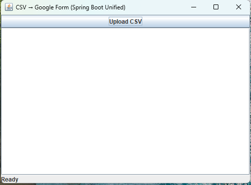

---

# 4. Main Screen Overview

## UI Components

| Component         | Purpose                 |
| ----------------- | ----------------------- |
| Upload CSV Button | Select CSV file         |
| Status Bar        | Shows upload state      |
| Log Panel         | Shows progress & errors |

### 📸 UI Layout Labels

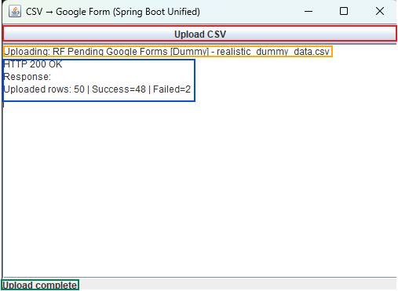

---

# 5. Uploading a CSV File

## Step 1 — Click Upload CSV

Click the **Upload CSV** button.

### 📸 Upload Button

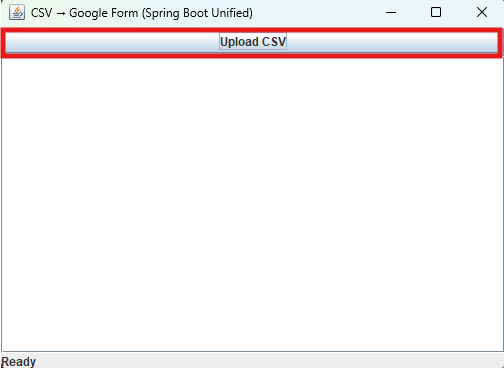

---

## Step 2 — Select File

Browse and select your CSV file.

### 📸 File Picker

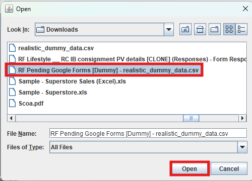

---

## Step 3 — Upload Process

While uploading:

* Status shows **Uploading...**
* Upload button is disabled
* Logs update in real‑time

### 📸 Upload In Progress

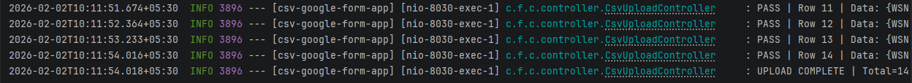

---

# 6. Upload Completion

## Successful Upload

* Status shows **Upload complete**
* Log displays success summary

### 📸 Upload Success Screen

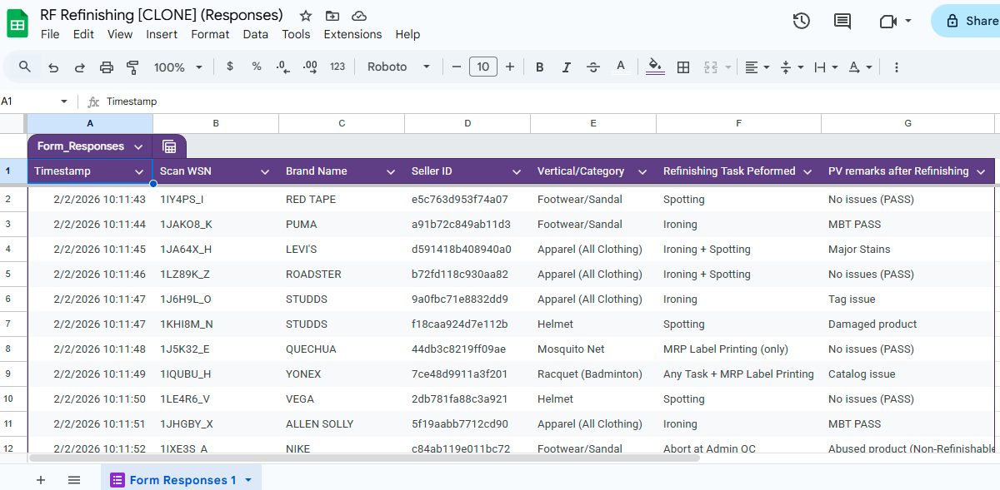

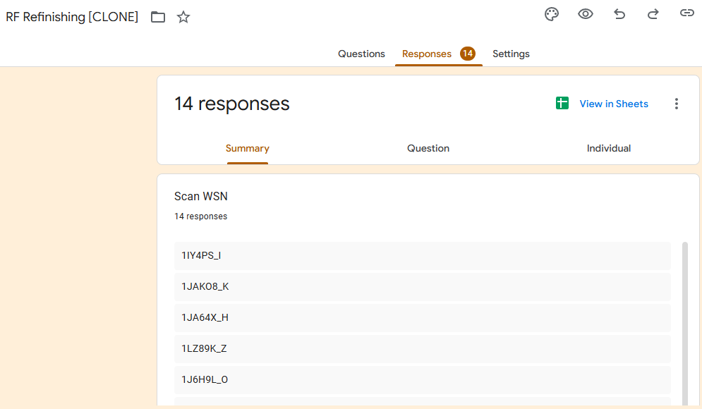

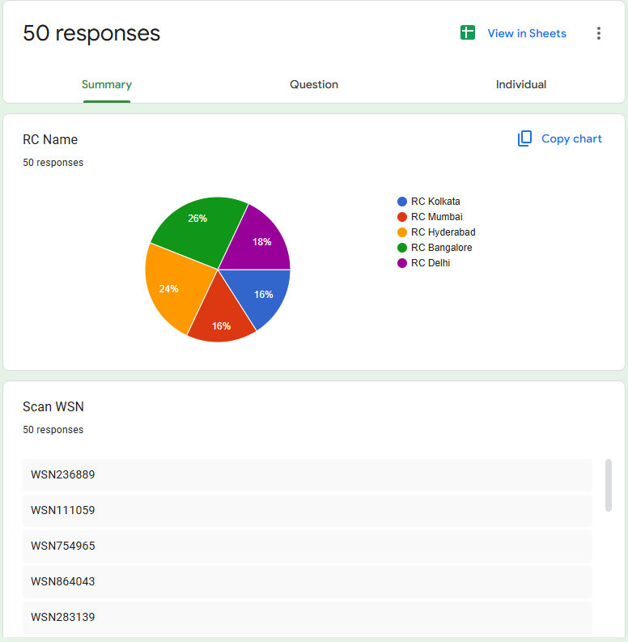

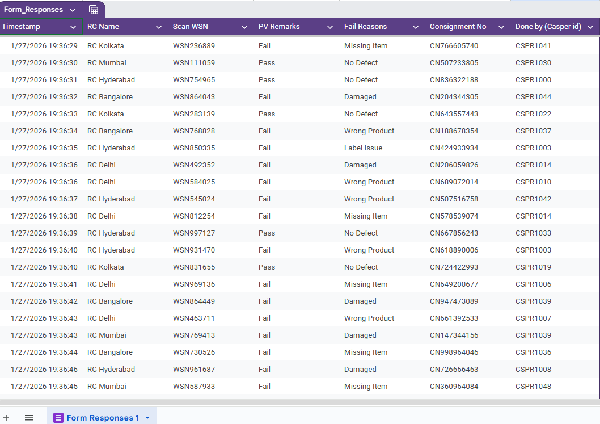

---

## Failed Upload

* Status shows **Upload failed**
* Log displays error message

### 📸 Upload Failure Screen

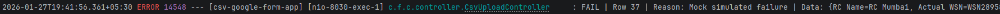

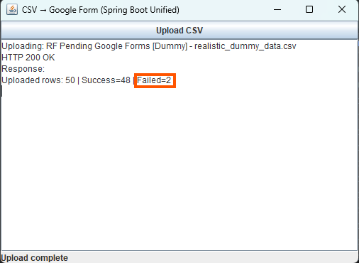

---

# 7. PASS & FAIL Output Files

After processing, two files are created:

## PASS File

```
pass_rows_YYYYMMDD_HHMMSS.csv
```

Contains successfully submitted rows.

### 📸 PASS File

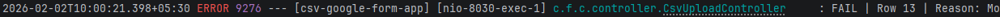
---

## FAIL File

```
fail_rows_YYYYMMDD_HHMMSS.csv
```

Contains failed rows plus error reason.

### 📸 FAIL File

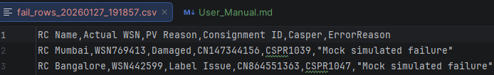

---

# 8. Understanding Fail Reasons

| Common Reason  | Meaning                 |
| -------------- | ----------------------- |
| Missing field  | CSV column empty        |
| Google timeout | Form submission delayed |
| Invalid data   | Format error            |

---

# 9. CSV File Format Requirements

## Required Columns

| Column Name    | Mandatory |
| -------------- | --------- |
| RC Name        | Yes       |
| Actual WSN     | Yes       |
| Consignment ID | Yes       |
| Casper         | Yes       |
| PV Reason      | Yes       |

### Sample CSV

```csv
RC Name,Actual WSN,Consignment ID,Casper,PV Reason
RC Kolkata,WSN123,CN12345,CPR111,No Defect
```

---

# 10. Mock Mode (Testing Without Google Forms)

Mock Mode simulates form submission.

### Enable Mock Mode

```bash
java -Dmock.google.forms=true -jar csv-uploader.jar
```

### When To Use

* Testing
* Training
* Demo mode

---

# 11. Rate Limiting (Automatic)

The system limits request speed to avoid Google Form throttling.

No action required from users.

---

# 12. Troubleshooting Guide

| Issue             | Resolution         |
| ----------------- | ------------------ |
| App does not open | Check Java version |
| Upload stuck      | Check internet     |
| CSV rejected      | Validate headers   |
| No output files   | Check app folder   |

---

# 13. Best Practices

* Validate CSV before upload
* Avoid editing CSV during upload
* Review FAIL file after each run
* Keep backup of original files

---

# 14. FAQ

**Q: Can I upload multiple files?**
A: Upload one file at a time.

**Q: Will failed rows retry automatically?**
A: Not currently.

**Q: Where are reports saved?**
A: Same folder as application JAR.

---

# 15. Support & Contact

If issues persist, contact the engineering or support team.

Provide logs and sample CSV when reporting issues.

---

# 🎉 End of User Manual
